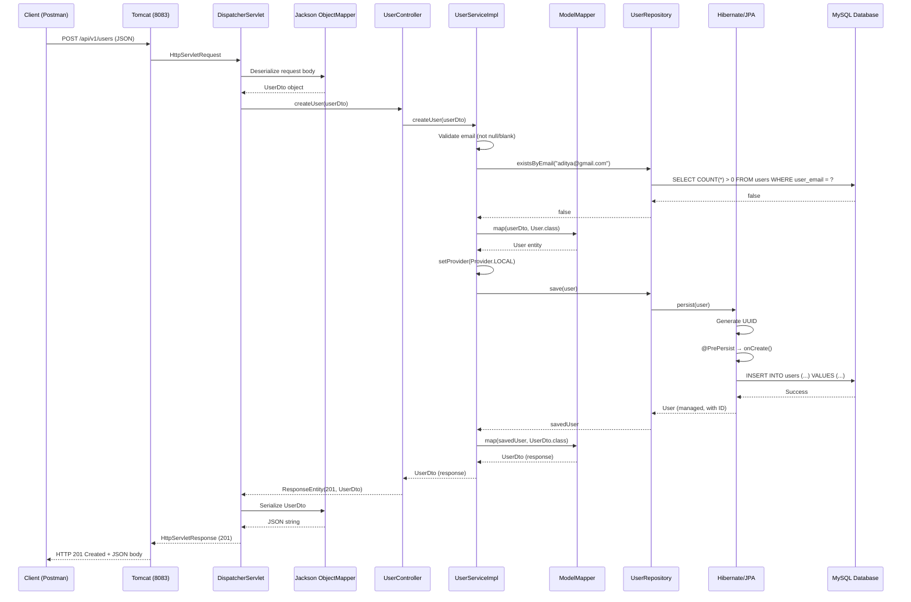

# 📝 CREATE USER API — Complete Execution Trace Documentation

## Table of Contents
1. [API Endpoint Details](#1-api-endpoint-details)
2. [Real-World Example Scenario](#2-real-world-example-scenario)
3. [Security Filter Chain Execution](#3-security-filter-chain-execution)
4. [Complete Step-by-Step Execution Flow](#4-complete-step-by-step-execution-flow)
5. [Line-by-Line Code Breakdown](#5-line-by-line-code-breakdown)
6. [Data Flow Tracking — Transformations at Each Layer](#6-data-flow-tracking--transformations-at-each-layer)
7. [Annotation Explanations in Context](#7-annotation-explanations-in-context)
8. [Summary Section](#8-summary-section)

---

## 1. API Endpoint Details

| Property          | Value                                      |
|-------------------|--------------------------------------------|
| **HTTP Method**   | `POST`                                     |
| **URL**           | `/api/v1/users`                            |
| **Content-Type**  | `application/json`                         |
| **Request Body**  | `UserDto` (JSON)                           |
| **Response Body** | `UserDto` (JSON)                           |
| **Success Status**| `201 CREATED`                              |
| **Auth Required** | ❌ No (Spring Security is disabled)        |
| **Server Port**   | `8083` (dev profile active)                |

### Request Body Schema

```json
{
  "email": "string (required, unique, max 300 chars)",
  "name": "string (optional)",
  "password": "string (optional)",
  "image": "string (optional)",
  "enable": "boolean (default: true)",
  "provider": "enum: LOCAL | GOOGLE | GITHUB | FACEBOOK (default: LOCAL)",
  "roles": "Set<Role> (optional, default: empty set)"
}
```

### Success Response (201 CREATED)

```json
{
  "id": "UUID (auto-generated)",
  "email": "string",
  "name": "string",
  "password": "string",
  "image": "string",
  "enable": true,
  "createdAt": "ISO-8601 Instant",
  "updatedAt": "ISO-8601 Instant",
  "provider": "LOCAL",
  "roles": []
}
```

### Error Responses

| Scenario              | Status Code | Response Body                                                              |
|-----------------------|-------------|---------------------------------------------------------------------------|
| Email is null/blank   | `400`       | `{ "message": "Email is required", "status": "BAD_REQUEST", "statusCode": 400 }` |
| Email already exists  | `400`       | `{ "message": "Email is alrady exists !!", "status": "BAD_REQUEST", "statusCode": 400 }` |

---

## 2. Real-World Example Scenario

> **Scenario**: A new user named **Aditya** wants to register on the platform. He fills in a signup form with his name, email, and password. The frontend sends a POST request to create his account.

### Example HTTP Request

```
POST http://localhost:8083/api/v1/users
Content-Type: application/json

{
  "email": "aditya@gmail.com",
  "name": "Aditya",
  "password": "securePass123",
  "image": "https://cdn.example.com/avatars/aditya.png",
  "enable": true,
  "provider": "LOCAL"
}
```

### Example HTTP Response (201 CREATED)

```json
{
  "id": "a1b2c3d4-e5f6-7890-abcd-ef1234567890",
  "email": "aditya@gmail.com",
  "name": "Aditya",
  "password": "securePass123",
  "image": "https://cdn.example.com/avatars/aditya.png",
  "enable": true,
  "createdAt": "2026-06-27T15:17:23.456Z",
  "updatedAt": "2026-06-27T15:17:23.456Z",
  "provider": "LOCAL",
  "roles": []
}
```

### What Happens Behind the Scenes (High-Level)

```
Client (Postman/Frontend)
    │
    ▼  POST /api/v1/users  { "email": "aditya@gmail.com", ... }
┌─────────────────────────────────────────────┐
│          Tomcat Embedded Server (8083)       │
│  ┌─────────────────────────────────────┐    │
│  │   DispatcherServlet                 │    │
│  │   ┌─────────────────────────────┐   │    │
│  │   │  UserController.createUser()│   │    │
│  │   │   ↓                         │   │    │
│  │   │  UserServiceImpl.createUser()│  │    │
│  │   │   ↓                         │   │    │
│  │   │  UserRepository.save()      │   │    │
│  │   │   ↓                         │   │    │
│  │   │  MySQL Database (INSERT)    │   │    │
│  │   └─────────────────────────────┘   │    │
│  └─────────────────────────────────────┘    │
└─────────────────────────────────────────────┘
    │
    ▼  Response: 201 CREATED + UserDto JSON
Client receives the created user
```

---

## 3. Security Filter Chain Execution

> [!IMPORTANT]
> **Spring Security is COMMENTED OUT in `pom.xml`**. There is **NO** security filter chain, **NO** `JwtAuthFilter`, and **NO** authentication/authorization enforcement active in this project.

### What This Means

When Spring Security's dependency is commented out:

1. **No `SecurityFilterChain` bean** is registered in the application context.
2. **No `DelegatingFilterProxy`** is added to the Servlet filter chain.
3. **No authentication filters** (BasicAuth, JWT, Form Login, etc.) execute before the request reaches the `DispatcherServlet`.
4. **Every endpoint is publicly accessible** — equivalent to `.permitAll()` on all routes.
5. The password field in `UserDto` is stored and returned **in plain text** — there is no `PasswordEncoder` bean or hashing.

### Request Path Without Spring Security

```
Client sends POST /api/v1/users
    │
    ▼
┌──────────────────────────────────────────────┐
│  Tomcat Embedded Server                      │
│  ┌──────────────────────────────────────┐    │
│  │  Standard Servlet Filters:           │    │
│  │  • CharacterEncodingFilter           │    │
│  │  • HiddenHttpMethodFilter            │    │
│  │  • FormContentFilter                 │    │
│  │  (NO Spring Security filters here!)  │    │
│  └──────────────────────────────────────┘    │
│    │                                         │
│    ▼                                         │
│  ┌──────────────────────────────────────┐    │
│  │  DispatcherServlet                   │    │
│  │  → HandlerMapping finds controller   │    │
│  │  → HandlerAdapter invokes method     │    │
│  └──────────────────────────────────────┘    │
└──────────────────────────────────────────────┘
```

> [!NOTE]
> If Spring Security were enabled, a `JwtAuthFilter` or similar filter would intercept this request **before** it reaches the `DispatcherServlet`. For a public registration endpoint, the security config would need `.requestMatchers("/api/v1/users").permitAll()` to allow unauthenticated access. Since Security is disabled entirely, this step is bypassed.

---

## 4. Complete Step-by-Step Execution Flow

### Phase 1: Application Startup (Before Any Request)

Before any API request can be handled, Spring Boot bootstraps the entire application. Here is what happens relevant to this API:

#### Step 1.1 — `AuthAppApplication.main()` Starts the App

```java
@SpringBootApplication
public class AuthAppApplication {
    public static void main(String[] args) {
        SpringApplication.run(AuthAppApplication.class, args);
    }
}
```

- `@SpringBootApplication` is a meta-annotation that combines:
  - `@Configuration` — marks this class as a source of bean definitions
  - `@EnableAutoConfiguration` — tells Spring Boot to auto-configure beans based on classpath dependencies (JPA, Web, etc.)
  - `@ComponentScan` — scans the package `com.substring.auth.auth_app` and all sub-packages for `@Component`, `@Service`, `@RestController`, `@Repository`, `@Configuration` annotated classes
- `SpringApplication.run()` creates the `ApplicationContext`, scans components, creates beans, and starts the embedded Tomcat server.

#### Step 1.2 — Component Scanning Discovers Beans

Spring scans and finds:

| Class                    | Annotation              | Bean Type                     |
|--------------------------|-------------------------|-------------------------------|
| `AuthAppApplication`     | `@SpringBootApplication`| Configuration / Entry point   |
| `ProjectConfig`          | `@Configuration`        | Configuration class           |
| `UserController`         | `@RestController`       | REST Controller bean          |
| `UserServiceImpl`        | `@Service`              | Service bean (implements `UserService`) |
| `UserRepository`         | extends `JpaRepository` | Spring Data JPA Repository proxy |
| `GlobalExceptionHandler` | `@RestControllerAdvice` | Global exception handler      |

#### Step 1.3 — `ProjectConfig` Creates the `ModelMapper` Bean

```java
@Configuration
public class ProjectConfig {
    @Bean
    public ModelMapper modelMapper() {
        return new ModelMapper();
    }
}
```

- `@Configuration` marks this as a configuration class — Spring treats its `@Bean` methods specially using CGLIB proxying.
- `@Bean` tells Spring to call `modelMapper()` and register the returned `ModelMapper` instance as a singleton bean in the `ApplicationContext`.
- This `ModelMapper` bean will be injected into `UserServiceImpl` via constructor injection.

#### Step 1.4 — `UserServiceImpl` Bean Is Created with Dependencies Injected

```java
@Service
@RequiredArgsConstructor
public class UserServiceImpl implements UserService {
    private final UserRepository userRepository;
    private final ModelMapper modelMapper;
    // ...
}
```

- `@RequiredArgsConstructor` (Lombok) generates a constructor with all `final` fields:
  ```java
  public UserServiceImpl(UserRepository userRepository, ModelMapper modelMapper) {
      this.userRepository = userRepository;
      this.modelMapper = modelMapper;
  }
  ```
- Spring's constructor injection kicks in:
  - It finds a bean of type `UserRepository` → the Spring Data JPA auto-generated proxy
  - It finds a bean of type `ModelMapper` → the one created in `ProjectConfig`
  - Both are injected into the `UserServiceImpl` constructor

#### Step 1.5 — `UserController` Bean Is Created with Dependencies Injected

```java
@RestController
@RequestMapping("/api/v1/users")
@AllArgsConstructor
public class UserController {
    private final UserService userService;
    // ...
}
```

- `@AllArgsConstructor` (Lombok) generates:
  ```java
  public UserController(UserService userService) {
      this.userService = userService;
  }
  ```
- Spring finds a bean that implements `UserService` → `UserServiceImpl` → injects it.

#### Step 1.6 — JPA / Hibernate Initializes the Database

Based on `application-dev.yml`:

```yaml
spring:
  datasource:
    url: jdbc:mysql://localhost:3306/auth_application_java
    username: root
    password: Aditya13325@
  jpa:
    hibernate:
      ddl-auto: update
```

- `ddl-auto: update` means Hibernate scans all `@Entity` classes (`User`, `Role`) and:
  - Creates the `users` table if it doesn't exist
  - Creates the `roles` table if it doesn't exist
  - Creates the `user_roles` join table if it doesn't exist
  - Adds any new columns that don't exist yet
  - **Never drops** existing columns or tables

- The `users` table schema (derived from the `User` entity):

  | Column       | Type           | Constraints                |
  |-------------|----------------|----------------------------|
  | `user_id`   | `BINARY(16)`   | PRIMARY KEY, auto-generated UUID |
  | `user_email`| `VARCHAR(300)` | UNIQUE, NOT NULL            |
  | `name`      | `VARCHAR(255)` |                            |
  | `password`  | `VARCHAR(255)` |                            |
  | `image`     | `VARCHAR(255)` |                            |
  | `enable`    | `BIT(1)`       | DEFAULT true               |
  | `created_at`| `DATETIME(6)`  |                            |
  | `updated_at`| `DATETIME(6)`  |                            |
  | `provider`  | `VARCHAR(255)` | Stores enum as string      |

#### Step 1.7 — Tomcat Starts on Port 8083

```
Tomcat started on port(s): 8083 (http)
Started AuthAppApplication in X.XXX seconds
```

The application is now ready to handle requests.

---

### Phase 2: HTTP Request Arrives

#### Step 2.1 — Client Sends the Request

```
POST http://localhost:8083/api/v1/users HTTP/1.1
Content-Type: application/json

{
  "email": "aditya@gmail.com",
  "name": "Aditya",
  "password": "securePass123",
  "image": "https://cdn.example.com/avatars/aditya.png",
  "enable": true,
  "provider": "LOCAL"
}
```

#### Step 2.2 — Tomcat Receives the Request

- Tomcat's `Connector` listening on port 8083 accepts the TCP connection.
- An `Http11NioProtocol` worker thread is assigned from Tomcat's thread pool (default pool size: 200).
- The raw HTTP bytes are parsed into an `HttpServletRequest` object.
- The request passes through Tomcat's standard servlet filters:
  - `CharacterEncodingFilter` → sets character encoding to UTF-8
  - `HiddenHttpMethodFilter` → checks for `_method` parameter (not applicable here)
  - `FormContentFilter` → checks for form-encoded data (not applicable for JSON)

#### Step 2.3 — `DispatcherServlet` Receives the Request

The `DispatcherServlet` is the front controller in Spring MVC. It:

1. **Consults `HandlerMapping`** — Looks through registered handler mappings to find which controller method handles `POST /api/v1/users`.
2. **Finds the match**: `UserController.createUser()` — because:
   - `@RequestMapping("/api/v1/users")` on the class matches the URL prefix `/api/v1/users`
   - `@PostMapping` on the method matches the HTTP method `POST` with no additional path
3. **Selects `HandlerAdapter`** — Uses `RequestMappingHandlerAdapter` to invoke the controller method.
4. **Resolves method arguments** — Uses `RequestResponseBodyMethodProcessor` to:
   - Read the request body input stream
   - Use `MappingJackson2HttpMessageConverter` (Jackson) to deserialize JSON → `UserDto` object

---

### Phase 3: Controller Layer

#### Step 3.1 — Jackson Deserializes JSON into `UserDto`

Before the controller method is even called, Jackson's `ObjectMapper` converts the JSON request body into a `UserDto` object.

**Jackson's process:**
1. Reads the JSON string from the `HttpServletRequest` input stream
2. Finds the `UserDto` class (specified by `@RequestBody` parameter type)
3. Creates a new `UserDto` instance using the **no-args constructor** (`@NoArgsConstructor`)
4. For each JSON key-value pair, calls the corresponding setter method (`@Setter` from Lombok):
   - `setEmail("aditya@gmail.com")`
   - `setName("Aditya")`
   - `setPassword("securePass123")`
   - `setImage("https://cdn.example.com/avatars/aditya.png")`
   - `setEnable(true)`
   - `setProvider(Provider.LOCAL)` — Jackson deserializes the string `"LOCAL"` into the `Provider.LOCAL` enum constant

**The `UserDto` object after deserialization:**

```
UserDto {
    id       = null                          ← not in request, remains null
    email    = "aditya@gmail.com"            ← from JSON
    name     = "Aditya"                      ← from JSON
    password = "securePass123"               ← from JSON (plain text!)
    image    = "https://cdn.example.com/avatars/aditya.png"  ← from JSON
    enable   = true                          ← from JSON
    createdAt = 2026-06-27T15:17:23.100Z     ← default field initializer (Instant.now())
    updatedAt = 2026-06-27T15:17:23.100Z     ← default field initializer (Instant.now())
    provider  = Provider.LOCAL               ← from JSON
    roles     = HashSet{}                    ← default field initializer (empty)
}
```

> [!NOTE]
> The `createdAt` and `updatedAt` fields get their default values from the field initializers in `UserDto` (`Instant.now()`), but these will be **overwritten** later by the `@PrePersist` lifecycle callback on the `User` entity. The `id` field is `null` because it was not provided in the request — Hibernate will auto-generate it.

#### Step 3.2 — `UserController.createUser()` Executes

```java
@PostMapping
public ResponseEntity<UserDto> createUser(@RequestBody UserDto userDto) {
    return ResponseEntity.status(HttpStatus.CREATED).body(userService.createUser(userDto));
}
```

**Line-by-line breakdown:**

**`@PostMapping`**
- Maps this method to `POST` requests on the base URL (`/api/v1/users`) defined by the class-level `@RequestMapping`.
- Combined URL: `POST /api/v1/users`
- If removed: Spring would not know which HTTP method this handler responds to. The request would get a `405 Method Not Allowed` or `404 Not Found`.

**`public ResponseEntity<UserDto>`**
- Return type is `ResponseEntity<UserDto>`, which allows the controller to set:
  - HTTP status code (201 CREATED)
  - Response headers
  - Response body (the `UserDto` object, serialized to JSON)
- If you returned just `UserDto` instead, the default status would be `200 OK` instead of `201 CREATED`.

**`@RequestBody UserDto userDto`**
- `@RequestBody` tells Spring to read the HTTP request body and deserialize it into a `UserDto` object using Jackson (as described in Step 3.1).
- Without `@RequestBody`, Spring would try to resolve the parameter from query parameters or path variables, and the `UserDto` would be empty/null.
- The `userDto` parameter at this point holds the fully deserialized object from Step 3.1.

**`userService.createUser(userDto)`**
- Calls `createUser()` on the injected `UserService` (which is actually `UserServiceImpl`).
- Passes the entire `UserDto` object.
- This is a **polymorphic call**: the `userService` variable is typed as `UserService` (interface), but at runtime it calls `UserServiceImpl.createUser()`.

**`ResponseEntity.status(HttpStatus.CREATED).body(...)`**
- `ResponseEntity.status(HttpStatus.CREATED)` — creates a `ResponseEntity` builder with HTTP status code `201`.
- `.body(userService.createUser(userDto))` — sets the response body to the `UserDto` returned by the service.
- The returned `ResponseEntity` tells Spring to:
  1. Set status code to `201 CREATED`
  2. Serialize the `UserDto` body to JSON using Jackson
  3. Set `Content-Type: application/json` header
- If you used `ResponseEntity.ok()` instead, the status would be `200 OK`, which is semantically wrong for a resource creation operation.

---

### Phase 4: Service Layer

#### Step 4.1 — `UserServiceImpl.createUser()` Executes

```java
@Override
@Transactional
public UserDto createUser(UserDto userDto) {
    if (userDto.getEmail() == null || userDto.getEmail().isBlank()) {
        throw new IllegalArgumentException("Email is required");
    }
    if (userRepository.existsByEmail(userDto.getEmail())) {
        throw new IllegalArgumentException("Email is alrady exists !!");
    }
    User user = modelMapper.map(userDto, User.class);
    user.setProvider(userDto.getProvider() != null ? userDto.getProvider() : Provider.LOCAL);
    User savedUser = userRepository.save(user);
    return modelMapper.map(savedUser, UserDto.class);
}
```

Let's trace **every single line** with our example data:

---

**Line: `@Override`**
- Indicates this method is implementing the `createUser()` method declared in the `UserService` interface.
- If removed: The code still compiles and works, but you lose the compile-time check that verifies this method signature matches an interface method. If the interface method signature changed, you wouldn't get a compilation error.

---

**Line: `@Transactional`**
- From `jakarta.transaction.Transactional`.
- Wraps the entire method in a **database transaction**.
- Spring creates a **transactional proxy** around `UserServiceImpl`. When `createUser()` is called:
  1. The proxy intercepts the call
  2. Opens a new database transaction (or joins an existing one)
  3. Calls the actual `createUser()` method
  4. If the method completes normally → **commits** the transaction
  5. If the method throws a runtime exception → **rolls back** the transaction
- If removed: Each database call (`existsByEmail`, `save`) would execute in its own auto-committed transaction. If `save()` failed after `existsByEmail()` succeeded, there would be no rollback of the overall operation. In this particular method, the practical difference is minimal because there's only one write operation (`save`), but it's still best practice.

---

**Line: `if (userDto.getEmail() == null || userDto.getEmail().isBlank())`**

```
userDto.getEmail() → "aditya@gmail.com"
"aditya@gmail.com" == null → false
```

- Since the first condition is `false`, Java's short-circuit `||` still evaluates the second condition:

```
"aditya@gmail.com".isBlank() → false
```

- The overall condition is `false || false` → `false`
- **We do NOT enter the if block.**

- `getEmail()` is generated by Lombok's `@Getter` annotation. It returns `this.email`.
- `.isBlank()` (Java 11+) returns `true` if the string is empty or contains only whitespace characters.

- **What if removed?** If this validation were removed and a null/blank email were passed, the `existsByEmail()` call would receive `null`, which could cause unexpected behavior, and the `userRepository.save()` would attempt to insert a row with a null email. Since the `user_email` column is `UNIQUE` but not explicitly `NOT NULL` in the entity mapping (though the `@Column(unique = true)` doesn't add NOT NULL), it would depend on the database schema whether this fails or succeeds.

---

**Line: `throw new IllegalArgumentException("Email is required");`**
- This line does **NOT execute** in our scenario (email is valid).
- If it did execute: It would throw an `IllegalArgumentException`, which would be caught by the `GlobalExceptionHandler`'s `handleIllegalArgumentException()` method, returning a `400 BAD_REQUEST` response.

---

**Line: `if (userRepository.existsByEmail(userDto.getEmail()))`**

```
userRepository.existsByEmail("aditya@gmail.com")
```

- This calls the `UserRepository.existsByEmail()` method.
- **Spring Data JPA query derivation**: Spring automatically generates a SQL query from the method name:

```sql
SELECT COUNT(*) > 0 FROM users WHERE user_email = 'aditya@gmail.com'
```

  Or equivalently:

```sql
SELECT CASE WHEN EXISTS (SELECT 1 FROM users WHERE user_email = 'aditya@gmail.com') THEN TRUE ELSE FALSE END
```

- **In our scenario**: Aditya is a new user, so no row exists with this email.
- **Result**: `false`
- The `if` condition is `false` → we do NOT enter the block.
- **What if removed?** If this check were removed and a duplicate email were submitted, the `userRepository.save()` call would attempt to insert a row with a duplicate `user_email`. Since the column has a `UNIQUE` constraint, MySQL would throw a `DataIntegrityViolationException`, which is not handled by the `GlobalExceptionHandler`. This would result in a generic `500 Internal Server Error` with an ugly stack trace instead of a clean `400 BAD_REQUEST`.

---

**Line: `throw new IllegalArgumentException("Email is alrady exists !!");`**
- This line does **NOT execute** in our scenario (email is new).
- Note: "alrady" is a typo in the source code (should be "already").

---

#### Step 4.2 — ModelMapper Converts `UserDto` → `User` Entity

**Line: `User user = modelMapper.map(userDto, User.class);`**

```
modelMapper.map(userDto, User.class)
```

- `modelMapper` is the `ModelMapper` bean injected via constructor (created in `ProjectConfig`).
- `modelMapper.map(source, destinationType)` performs object-to-object mapping.

**How ModelMapper works internally:**

1. Creates a new `User` instance using its no-args constructor (`@NoArgsConstructor`).
2. Uses **intelligent matching** — it matches properties by name between `UserDto` and `User`.
3. For each matching property, it calls the getter on the source (`UserDto`) and the setter on the destination (`User`).

**Field-by-field mapping:**

| UserDto Field  | Value                          | User Field     | Mapped Value               | Notes                          |
|----------------|--------------------------------|----------------|-----------------------------|--------------------------------|
| `id`           | `null`                         | `id`           | `null`                      | Will be auto-generated by JPA  |
| `email`        | `"aditya@gmail.com"`           | `email`        | `"aditya@gmail.com"`        | Direct copy                    |
| `name`         | `"Aditya"`                     | `name`         | `"Aditya"`                  | Direct copy                    |
| `password`     | `"securePass123"`              | `password`     | `"securePass123"`           | Direct copy (plain text!)      |
| `image`        | `"https://cdn.example.com/..."` | `image`       | `"https://cdn.example.com/..."` | Direct copy                |
| `enable`       | `true`                         | `enable`       | `true`                      | Direct copy                    |
| `createdAt`    | `2026-06-27T15:17:23.100Z`     | `createdAt`    | `2026-06-27T15:17:23.100Z`  | From DTO default initializer   |
| `updatedAt`    | `2026-06-27T15:17:23.100Z`     | `updatedAt`    | `2026-06-27T15:17:23.100Z`  | From DTO default initializer   |
| `provider`     | `Provider.LOCAL`               | `provider`     | `Provider.LOCAL`             | Direct copy (enum)             |
| `roles`        | `HashSet{}` (empty)            | `roles`        | `HashSet{}` (empty)          | Direct copy (empty set)        |

**The `User` entity object after ModelMapper mapping:**

```
User {
    id        = null                              ← not set yet
    email     = "aditya@gmail.com"
    name      = "Aditya"
    password  = "securePass123"
    image     = "https://cdn.example.com/avatars/aditya.png"
    enable    = true
    createdAt = 2026-06-27T15:17:23.100Z          ← from DTO
    updatedAt = 2026-06-27T15:17:23.100Z          ← from DTO
    provider  = Provider.LOCAL
    roles     = HashSet{}
}
```

- **What if removed?** You would have to manually create the `User` object and set each field individually — lots of boilerplate code. ModelMapper automates this.

---

#### Step 4.3 — Provider Defaulting

**Line: `user.setProvider(userDto.getProvider() != null ? userDto.getProvider() : Provider.LOCAL);`**

```
userDto.getProvider() → Provider.LOCAL (not null)
Provider.LOCAL != null → true
user.setProvider(Provider.LOCAL)
```

- This is a safety net: if the client didn't send a `provider` field in the request, the DTO would have `Provider.LOCAL` as its default value (from the field initializer `private Provider provider = Provider.LOCAL`). But even if someone explicitly sent `null`, this line ensures `Provider.LOCAL` is set.
- In our example, the client sent `"provider": "LOCAL"`, so `getProvider()` returns `Provider.LOCAL`, and it's set again (no change).
- `setProvider()` is generated by Lombok's `@Setter`.
- **What if removed?** If the client sent a request without a `provider` field, ModelMapper would have already mapped the DTO's default `Provider.LOCAL` to the entity. So in most cases, removing this line wouldn't change behavior. However, if the client explicitly sent `"provider": null` in the JSON, ModelMapper would map `null` to the entity's `provider` field, and without this line, the entity would be saved with a `null` provider (which could violate business rules).

---

### Phase 5: Repository Layer (Database Interaction)

#### Step 5.1 — `userRepository.save(user)` Executes

**Line: `User savedUser = userRepository.save(user);`**

```
userRepository.save(user)
```

- `userRepository` is a Spring Data JPA proxy that implements `JpaRepository<User, UUID>`.
- `.save(user)` calls the underlying `SimpleJpaRepository.save()` method.
- Since `user.getId()` is `null`, JPA treats this as a **new entity** (INSERT), not an update.

**What happens inside `save()`:**

1. **`EntityManager.persist(user)` is called** (because `id` is null → new entity).
2. **`@GeneratedValue(strategy = GenerationType.UUID)`** on the `id` field tells Hibernate to generate a UUID before inserting.
3. Hibernate generates a UUID: `a1b2c3d4-e5f6-7890-abcd-ef1234567890`.
4. Sets `user.id = a1b2c3d4-e5f6-7890-abcd-ef1234567890`.
5. **`@PrePersist` lifecycle callback `onCreate()` fires:**

```java
@PrePersist
protected void onCreate() {
    Instant now = Instant.now();
    if (createdAt == null) createdAt = now;
    updatedAt = now;
}
```

- `Instant now = Instant.now()` → captures the current timestamp: `2026-06-27T15:17:23.456Z`
- `if (createdAt == null)` → `createdAt` is NOT null (it was set by the field initializer and then by ModelMapper), so this condition is `false`. `createdAt` retains its existing value.
- `updatedAt = now` → `updatedAt` is overwritten to the new `Instant.now()` value: `2026-06-27T15:17:23.456Z`

> [!TIP]
> The `@PrePersist` ensures `updatedAt` is always the exact time of database insertion, regardless of what value was mapped from the DTO.

6. **Hibernate generates and executes the SQL INSERT:**

```sql
INSERT INTO users (user_id, user_email, name, password, image, enable, created_at, updated_at, provider)
VALUES (
    UUID_TO_BIN('a1b2c3d4-e5f6-7890-abcd-ef1234567890'),
    'aditya@gmail.com',
    'Aditya',
    'securePass123',
    'https://cdn.example.com/avatars/aditya.png',
    1,
    '2026-06-27 15:17:23.100000',
    '2026-06-27 15:17:23.456000',
    'LOCAL'
);
```

7. **MySQL executes the INSERT**, creates a new row in the `users` table.
8. Since `roles` is an empty set, **no rows are inserted** into the `user_roles` join table.
9. The `save()` method returns the **managed entity** — the same `User` object, now with:
   - `id` set to the generated UUID
   - `createdAt` and `updatedAt` set to proper timestamps
   - The entity is now in the **managed/persistent** state in the JPA persistence context.

**The `savedUser` object:**

```
User (savedUser) {
    id        = a1b2c3d4-e5f6-7890-abcd-ef1234567890   ← generated!
    email     = "aditya@gmail.com"
    name      = "Aditya"
    password  = "securePass123"
    image     = "https://cdn.example.com/avatars/aditya.png"
    enable    = true
    createdAt = 2026-06-27T15:17:23.100Z
    updatedAt = 2026-06-27T15:17:23.456Z                ← updated by @PrePersist
    provider  = Provider.LOCAL
    roles     = HashSet{}
}
```

- **What if `userRepository.save()` were removed?** The user would never be persisted to the database. The method would map the DTO to an entity, but without saving it, the user wouldn't exist in the system. There would be no generated ID, and the returned DTO would have `id = null`.

---

#### Step 5.2 — Transaction Commits

- Since `createUser()` is annotated with `@Transactional` and no exception was thrown, the transactional proxy **commits** the transaction.
- The SQL INSERT is committed to MySQL.
- The `User` entity becomes a permanent row in the database.

---

### Phase 6: Response Mapping

#### Step 6.1 — ModelMapper Converts `User` Entity → `UserDto`

**Line: `return modelMapper.map(savedUser, UserDto.class);`**

```
modelMapper.map(savedUser, UserDto.class)
```

- Creates a new `UserDto` instance (using no-args constructor).
- Maps all matching fields from `savedUser` (User entity) to the new `UserDto`.

**Field-by-field mapping:**

| User Field     | Value                              | UserDto Field  | Mapped Value                    |
|----------------|------------------------------------|----------------|---------------------------------|
| `id`           | `a1b2c3d4-e5f6-7890-abcd-ef1234567890` | `id`      | `a1b2c3d4-e5f6-7890-abcd-ef1234567890` |
| `email`        | `"aditya@gmail.com"`               | `email`        | `"aditya@gmail.com"`            |
| `name`         | `"Aditya"`                         | `name`         | `"Aditya"`                      |
| `password`     | `"securePass123"`                  | `password`     | `"securePass123"`               |
| `image`        | `"https://cdn.example.com/..."`    | `image`        | `"https://cdn.example.com/..."` |
| `enable`       | `true`                             | `enable`       | `true`                          |
| `createdAt`    | `2026-06-27T15:17:23.100Z`         | `createdAt`    | `2026-06-27T15:17:23.100Z`      |
| `updatedAt`    | `2026-06-27T15:17:23.456Z`         | `updatedAt`    | `2026-06-27T15:17:23.456Z`      |
| `provider`     | `Provider.LOCAL`                   | `provider`     | `Provider.LOCAL`                |
| `roles`        | `HashSet{}`                        | `roles`        | `HashSet{}`                     |

**The returned `UserDto` object:**

```
UserDto {
    id        = a1b2c3d4-e5f6-7890-abcd-ef1234567890
    email     = "aditya@gmail.com"
    name      = "Aditya"
    password  = "securePass123"
    image     = "https://cdn.example.com/avatars/aditya.png"
    enable    = true
    createdAt = 2026-06-27T15:17:23.100Z
    updatedAt = 2026-06-27T15:17:23.456Z
    provider  = Provider.LOCAL
    roles     = HashSet{}
}
```

> [!WARNING]
> The password is returned **in plain text** in the response. In a production application, you would either:
> 1. Use `@JsonIgnore` on the `password` field in `UserDto` to exclude it from serialization, or
> 2. Hash the password before saving (using `BCryptPasswordEncoder`), or
> 3. Create a separate response DTO that doesn't include the password field.

---

### Phase 7: Response Serialization and Delivery

#### Step 7.1 — Controller Returns `ResponseEntity`

Back in `UserController.createUser()`:

```java
return ResponseEntity.status(HttpStatus.CREATED).body(userService.createUser(userDto));
```

- `userService.createUser(userDto)` has returned the `UserDto` described above.
- `ResponseEntity.status(HttpStatus.CREATED)` → creates a builder with status `201`
- `.body(userDto)` → attaches the `UserDto` as the response body
- The final `ResponseEntity` object:
  ```
  ResponseEntity {
      status  = 201 CREATED
      headers = {}
      body    = UserDto { id=a1b2c3d4..., email="aditya@gmail.com", ... }
  }
  ```

#### Step 7.2 — Spring MVC Serializes the Response

1. `RequestMappingHandlerAdapter` receives the `ResponseEntity` from the controller.
2. `HttpEntityMethodProcessor` processes the `ResponseEntity`:
   - Sets the HTTP status code to `201`
   - Delegates body serialization to `MappingJackson2HttpMessageConverter`
3. Jackson's `ObjectMapper` serializes the `UserDto` to JSON:
   - Calls every getter method on `UserDto` (generated by `@Getter`)
   - Converts `UUID` to its string representation
   - Converts `Instant` to ISO-8601 string
   - Converts `Provider` enum to its name string `"LOCAL"`
   - Converts empty `Set<Role>` to an empty JSON array `[]`
4. Sets the `Content-Type` header to `application/json`

**Serialized JSON response body:**

```json
{
  "id": "a1b2c3d4-e5f6-7890-abcd-ef1234567890",
  "email": "aditya@gmail.com",
  "name": "Aditya",
  "password": "securePass123",
  "image": "https://cdn.example.com/avatars/aditya.png",
  "enable": true,
  "createdAt": "2026-06-27T15:17:23.100Z",
  "updatedAt": "2026-06-27T15:17:23.456Z",
  "provider": "LOCAL",
  "roles": []
}
```

#### Step 7.3 — Tomcat Sends the HTTP Response

```
HTTP/1.1 201 Created
Content-Type: application/json
Transfer-Encoding: chunked

{
  "id": "a1b2c3d4-e5f6-7890-abcd-ef1234567890",
  "email": "aditya@gmail.com",
  "name": "Aditya",
  "password": "securePass123",
  "image": "https://cdn.example.com/avatars/aditya.png",
  "enable": true,
  "createdAt": "2026-06-27T15:17:23.100Z",
  "updatedAt": "2026-06-27T15:17:23.456Z",
  "provider": "LOCAL",
  "roles": []
}
```

The Tomcat worker thread writes the HTTP response bytes to the TCP socket and returns to the thread pool.

---

### Phase 8: Error Scenarios (Alternate Flows)

#### Error Scenario 1: Email is Null or Blank

**Request:**
```json
{
  "name": "Aditya",
  "password": "securePass123"
}
```

**Flow:**
```
UserController.createUser()
    ↓
UserServiceImpl.createUser()
    ↓
userDto.getEmail() → null
null == null → true
    ↓
throw new IllegalArgumentException("Email is required")
    ↓
GlobalExceptionHandler.handleIllegalArgumentException()
    ↓
ErrorResponse { message: "Email is required", status: BAD_REQUEST, statusCode: 400 }
    ↓
ResponseEntity<ErrorResponse> with status 400
```

**Response:**
```json
HTTP/1.1 400 Bad Request
{
  "message": "Email is required",
  "status": "BAD_REQUEST",
  "statusCode": 400
}
```

> [!CAUTION]
> There is a **bug** in `GlobalExceptionHandler.handleIllegalArgumentException()` — the parameter type is `ResourceNotFoundException` instead of `IllegalArgumentException`:
> ```java
> @ExceptionHandler(IllegalArgumentException.class)
> public ResponseEntity<ErrorResponse> handleIllegalArgumentException(ResourceNotFoundException exception) {
> ```
> The `@ExceptionHandler(IllegalArgumentException.class)` annotation correctly catches `IllegalArgumentException`, but the method parameter expects `ResourceNotFoundException`. This will cause a runtime error because Spring cannot inject an `IllegalArgumentException` into a `ResourceNotFoundException` parameter. The actual behavior would be a `500 Internal Server Error` instead of a clean `400 BAD_REQUEST`.

#### Error Scenario 2: Duplicate Email

**Request (second time with same email):**
```json
{
  "email": "aditya@gmail.com",
  "name": "Aditya Duplicate",
  "password": "otherPass"
}
```

**Flow:**
```
UserController.createUser()
    ↓
UserServiceImpl.createUser()
    ↓
userDto.getEmail() → "aditya@gmail.com" (not null, not blank)
    ↓
userRepository.existsByEmail("aditya@gmail.com")
    ↓
SQL: SELECT COUNT(*) > 0 FROM users WHERE user_email = 'aditya@gmail.com'
    ↓
Result: true (already exists from previous request)
    ↓
throw new IllegalArgumentException("Email is alrady exists !!")
    ↓
GlobalExceptionHandler.handleIllegalArgumentException() (with the bug noted above)
```

---

## 5. Line-by-Line Code Breakdown

### 5.1 `UserController.java` — Lines Involved in Create User

```java
@RestController
```
- **What it does**: Combines `@Controller` + `@ResponseBody`. Tells Spring this class handles HTTP requests and every method's return value is written directly to the response body (not resolved as a view name).
- **Who calls it**: Spring's component scanner during startup.
- **What breaks if removed**: Spring won't register this class as a request handler. All endpoints in this controller return `404 Not Found`.

```java
@RequestMapping("/api/v1/users")
```
- **What it does**: Sets the base URL path prefix for all handler methods in this class.
- **Who calls it**: `RequestMappingHandlerMapping` during startup — it registers all URL-to-handler mappings.
- **What breaks if removed**: Each method's `@GetMapping`, `@PostMapping`, etc. would map to the root path `/`. The `createUser()` method would be mapped to `POST /` instead of `POST /api/v1/users`.

```java
@AllArgsConstructor
```
- **What it does**: Lombok generates a constructor with all fields: `public UserController(UserService userService)`.
- **Who calls it**: Lombok annotation processor at compile time.
- **What breaks if removed**: No constructor is generated. Spring cannot inject `UserService` via constructor injection. You'd get a `NoSuchBeanDefinitionException` or the field would be `null` (if using field injection with `@Autowired`).

```java
private final UserService userService;
```
- **What it does**: Declares a dependency on `UserService`. The `final` keyword ensures it can only be assigned once (in the constructor).
- **Who calls it**: Spring's dependency injection container — finds the bean that implements `UserService` (`UserServiceImpl`) and passes it to the constructor.
- **What breaks if removed**: No reference to the service layer. The controller cannot delegate business logic.

```java
@PostMapping
```
- **What it does**: Shorthand for `@RequestMapping(method = RequestMethod.POST)`. Maps this method to POST requests on the base path `/api/v1/users`.
- **What breaks if removed**: This method would not be registered as a handler for any HTTP method. `POST /api/v1/users` would return `405 Method Not Allowed`.

```java
public ResponseEntity<UserDto> createUser(@RequestBody UserDto userDto) {
```
- **What it does**: Declares the handler method. `@RequestBody` binds the JSON request body to the `userDto` parameter.
- **Who calls it**: `RequestMappingHandlerAdapter` via reflection when a matching request arrives.
- **What breaks if removed**: The POST endpoint ceases to exist.

```java
return ResponseEntity.status(HttpStatus.CREATED).body(userService.createUser(userDto));
```
- **What it does**: Calls the service, wraps the result in a 201 response.
- **What data it receives**: The `userDto` deserialized from JSON.
- **What it returns**: `ResponseEntity<UserDto>` with status 201 and the saved user data.
- **What breaks if removed**: No response would be returned. Spring would send a `200 OK` with an empty body (or throw an error).

---

### 5.2 `UserServiceImpl.java` — Lines Involved in Create User

```java
@Service
```
- **What it does**: A specialization of `@Component`. Tells Spring to register this class as a bean. Semantically indicates this is a service-layer component.
- **What breaks if removed**: Spring doesn't create this bean. `UserController` fails to start because no `UserService` bean is available for injection.

```java
@RequiredArgsConstructor
```
- **What it does**: Lombok generates a constructor with all `final` fields:
  ```java
  public UserServiceImpl(UserRepository userRepository, ModelMapper modelMapper) { ... }
  ```
- **What breaks if removed**: No constructor for dependency injection. The `userRepository` and `modelMapper` fields would be `null`.

```java
private final UserRepository userRepository;
private final ModelMapper modelMapper;
```
- **What they do**: Declare dependencies on the repository (for database access) and ModelMapper (for DTO↔Entity conversion).
- **What breaks if removed**: `NullPointerException` at every usage of these fields.

```java
@Override
```
- **What it does**: Compile-time check that this method overrides a method from `UserService` interface.
- **What breaks if removed**: Nothing breaks at runtime, but you lose compile-time safety.

```java
@Transactional
```
- **What it does**: Spring wraps this method in a database transaction proxy.
- **What breaks if removed**: No explicit transaction management. In this case, since there's only one `save()` call, the practical impact is minimal, but if there were multiple DB operations, they wouldn't be atomic.

```java
public UserDto createUser(UserDto userDto) {
```
- **What it does**: Method signature — accepts a `UserDto`, returns a `UserDto`.
- **What data it receives**: The `UserDto` with email `"aditya@gmail.com"`, name `"Aditya"`, etc.

```java
if (userDto.getEmail() == null || userDto.getEmail().isBlank()) {
    throw new IllegalArgumentException("Email is required");
}
```
- **What it does**: Validates that the email is not null and not blank (empty or whitespace-only).
- **In our example**: `"aditya@gmail.com"` is not null and not blank → validation passes.
- **What breaks if removed**: Null or blank emails could be inserted into the database. If `email` is null, the `existsByEmail(null)` call on the next line could produce unexpected results.

```java
if (userRepository.existsByEmail(userDto.getEmail())) {
    throw new IllegalArgumentException("Email is alrady exists !!");
}
```
- **What it does**: Checks if a user with this email already exists in the database.
- **Database query**: `SELECT COUNT(*) > 0 FROM users WHERE user_email = 'aditya@gmail.com'`
- **In our example**: No existing user → returns `false` → continues.
- **What breaks if removed**: Duplicate emails would cause a database `UNIQUE` constraint violation (`DataIntegrityViolationException`) instead of a clean `IllegalArgumentException`.

```java
User user = modelMapper.map(userDto, User.class);
```
- **What it does**: Converts `UserDto` → `User` entity by matching field names.
- **What data it receives**: The validated `UserDto`.
- **What it returns**: A new `User` entity with all fields copied from the DTO.
- **What breaks if removed**: No entity object to persist. The `save()` call would have nothing to save.

```java
user.setProvider(userDto.getProvider() != null ? userDto.getProvider() : Provider.LOCAL);
```
- **What it does**: Ensures the `provider` field is never null. Defaults to `Provider.LOCAL` if not specified.
- **In our example**: `getProvider()` returns `Provider.LOCAL` (not null) → sets `Provider.LOCAL`.
- **What breaks if removed**: If a client sends `"provider": null` explicitly, the entity would have a null provider, which could cause issues downstream.

```java
User savedUser = userRepository.save(user);
```
- **What it does**: Persists the `User` entity to the MySQL database.
- **What data it receives**: The `User` entity with all fields set (but `id` is null).
- **What it returns**: The same `User` entity, now with:
  - `id` set to the auto-generated UUID
  - `updatedAt` updated by `@PrePersist`
- **Database operation**: `INSERT INTO users (...) VALUES (...)`
- **What breaks if removed**: The user is never saved to the database. The entire purpose of this API is defeated.

```java
return modelMapper.map(savedUser, UserDto.class);
```
- **What it does**: Converts the saved `User` entity back to a `UserDto` for the response.
- **What data it receives**: The persisted `User` entity with the generated `id`.
- **What it returns**: A `UserDto` with all fields from the saved entity, including the generated `id`.
- **What breaks if removed**: The method would have no return value → compile error (return type is `UserDto`).

---

### 5.3 `User.java` — Entity Lines Involved

```java
@Entity
```
- **What it does**: Marks this class as a JPA entity — a Java class that maps to a database table.
- **What breaks if removed**: Hibernate ignores this class entirely. No `users` table is created. `UserRepository` cannot work.

```java
@Table(name = "users")
```
- **What it does**: Specifies the database table name as `users` (instead of the default `user`, which is a reserved word in some databases).
- **What breaks if removed**: Hibernate would use the class name `User` as the table name, which is a reserved keyword in MySQL. This would cause SQL syntax errors.

```java
@Id
@GeneratedValue(strategy = GenerationType.UUID)
@Column(name = "user_id")
private UUID id;
```
- `@Id` — marks this field as the primary key.
- `@GeneratedValue(strategy = GenerationType.UUID)` — Hibernate auto-generates a UUID value before INSERT.
- `@Column(name = "user_id")` — maps this field to the `user_id` column in the database.
- **What breaks if removed**: No primary key → JPA cannot manage this entity. The application fails to start with a mapping exception.

```java
@Column(name = "user_email", unique = true, length = 300)
private String email;
```
- `@Column(name = "user_email")` — maps to column `user_email`.
- `unique = true` — adds a UNIQUE constraint to this column.
- `length = 300` — sets the column type to `VARCHAR(300)`.
- **What breaks if removed**: The column would use default naming (`email`), no unique constraint (duplicate emails possible at DB level), and default `VARCHAR(255)`.

```java
@Enumerated(EnumType.STRING)
private Provider provider = Provider.LOCAL;
```
- `@Enumerated(EnumType.STRING)` — stores the enum value as its name string (e.g., `"LOCAL"`, `"GOOGLE"`) rather than its ordinal number (0, 1, 2, 3).
- **What breaks if removed**: Without `@Enumerated`, JPA defaults to `EnumType.ORDINAL`, storing `0` for `LOCAL`, `1` for `GOOGLE`, etc. If enum values are reordered, existing data becomes corrupted.

```java
@PrePersist
protected void onCreate() {
    Instant now = Instant.now();
    if (createdAt == null) createdAt = now;
    updatedAt = now;
}
```
- **What it does**: JPA lifecycle callback that fires just before the entity is first persisted (INSERT).
- **In our example**: Sets `updatedAt` to the current time. `createdAt` is not null (field initializer set it), so it remains unchanged.
- **What breaks if removed**: The `createdAt` and `updatedAt` fields would keep whatever values ModelMapper set from the DTO, which might not reflect the actual persistence time.

```java
@ManyToMany(fetch = FetchType.EAGER)
@JoinTable(
    name = "user_roles",
    joinColumns = @JoinColumn(name = "user_id"),
    inverseJoinColumns = @JoinColumn(name = "role_id")
)
private Set<Role> roles = new HashSet<>();
```
- `@ManyToMany` — defines a many-to-many relationship between `User` and `Role`.
- `fetch = FetchType.EAGER` — roles are always loaded with the user (no lazy loading).
- `@JoinTable` — creates a join table `user_roles` with columns `user_id` and `role_id`.
- **In our example**: `roles` is empty → no rows are inserted into `user_roles`.
- **What breaks if removed**: No relationship between users and roles. The `roles` field would not be persisted.

---

## 6. Data Flow Tracking — Transformations at Each Layer

### Complete Data Journey Visualization

```
┌─────────────────────────────────────────────────────────────────────────────┐
│ LAYER 1: CLIENT                                                            │
│                                                                             │
│  JSON String:                                                               │
│  {                                                                          │
│    "email": "aditya@gmail.com",                                             │
│    "name": "Aditya",                                                        │
│    "password": "securePass123",                                             │
│    "image": "https://cdn.example.com/avatars/aditya.png",                   │
│    "enable": true,                                                          │
│    "provider": "LOCAL"                                                      │
│  }                                                                          │
└──────────────────────────────────┬──────────────────────────────────────────┘
                                   │ HTTP POST (JSON bytes over TCP)
                                   ▼
┌─────────────────────────────────────────────────────────────────────────────┐
│ LAYER 2: TOMCAT + SPRING MVC (DispatcherServlet)                           │
│                                                                             │
│  Jackson ObjectMapper deserializes JSON → UserDto object                    │
│                                                                             │
│  UserDto {                                                                  │
│    id        = null                                                         │
│    email     = "aditya@gmail.com"                                           │
│    name      = "Aditya"                                                     │
│    password  = "securePass123"                                              │
│    image     = "https://cdn.example.com/avatars/aditya.png"                 │
│    enable    = true                                                         │
│    createdAt = 2026-06-27T15:17:23.100Z  (field default)                    │
│    updatedAt = 2026-06-27T15:17:23.100Z  (field default)                    │
│    provider  = Provider.LOCAL                                               │
│    roles     = HashSet{} (empty)                                            │
│  }                                                                          │
└──────────────────────────────────┬──────────────────────────────────────────┘
                                   │ Method argument injection
                                   ▼
┌─────────────────────────────────────────────────────────────────────────────┐
│ LAYER 3: CONTROLLER (UserController.createUser)                            │
│                                                                             │
│  Receives: UserDto (same object as above, no transformation)                │
│  Action:   Delegates to userService.createUser(userDto)                     │
│  Returns:  ResponseEntity<UserDto> with status 201                          │
│                                                                             │
│  No data transformation at this layer — pure delegation                     │
└──────────────────────────────────┬──────────────────────────────────────────┘
                                   │ Pass-through
                                   ▼
┌─────────────────────────────────────────────────────────────────────────────┐
│ LAYER 4: SERVICE (UserServiceImpl.createUser)                              │
│                                                                             │
│  Step A: Validate email (not null, not blank) ✓                             │
│  Step B: Check duplicate email in DB → false ✓                              │
│                                                                             │
│  Step C: ModelMapper converts UserDto → User entity:                        │
│  User {                                                                     │
│    id        = null               ← not generated yet                       │
│    email     = "aditya@gmail.com"                                           │
│    name      = "Aditya"                                                     │
│    password  = "securePass123"                                              │
│    image     = "https://cdn.example.com/avatars/aditya.png"                 │
│    enable    = true                                                         │
│    createdAt = 2026-06-27T15:17:23.100Z                                     │
│    updatedAt = 2026-06-27T15:17:23.100Z                                     │
│    provider  = Provider.LOCAL                                               │
│    roles     = HashSet{} (empty)                                            │
│  }                                                                          │
│                                                                             │
│  Step D: Set provider (Provider.LOCAL, already set)                         │
│                                                                             │
│  Step E: userRepository.save(user) → savedUser                              │
│                                                                             │
│  Step F: ModelMapper converts savedUser (User) → UserDto:                   │
│  UserDto {                                                                  │
│    id        = a1b2c3d4-e5f6-7890-abcd-ef1234567890  ← NOW GENERATED       │
│    email     = "aditya@gmail.com"                                           │
│    name      = "Aditya"                                                     │
│    password  = "securePass123"                                              │
│    image     = "https://cdn.example.com/avatars/aditya.png"                 │
│    enable    = true                                                         │
│    createdAt = 2026-06-27T15:17:23.100Z                                     │
│    updatedAt = 2026-06-27T15:17:23.456Z  ← UPDATED BY @PrePersist          │
│    provider  = Provider.LOCAL                                               │
│    roles     = HashSet{} (empty)                                            │
│  }                                                                          │
└──────────────────────────────────┬──────────────────────────────────────────┘
                                   │ save(user)
                                   ▼
┌─────────────────────────────────────────────────────────────────────────────┐
│ LAYER 5: REPOSITORY (UserRepository / SimpleJpaRepository / Hibernate)     │
│                                                                             │
│  Step 1: EntityManager.persist(user) called (id is null → INSERT)           │
│  Step 2: Hibernate generates UUID: a1b2c3d4-e5f6-7890-abcd-ef1234567890    │
│  Step 3: @PrePersist callback onCreate() fires                              │
│          → updatedAt = Instant.now() = 2026-06-27T15:17:23.456Z             │
│  Step 4: Hibernate generates SQL INSERT                                     │
│  Step 5: Returns managed User entity with generated ID                      │
└──────────────────────────────────┬──────────────────────────────────────────┘
                                   │ SQL INSERT
                                   ▼
┌─────────────────────────────────────────────────────────────────────────────┐
│ LAYER 6: DATABASE (MySQL — auth_application_java)                          │
│                                                                             │
│  Table: users                                                               │
│  ┌──────────────┬───────────────────────┬─────────┬──────────────┬────────┐ │
│  │ user_id      │ user_email            │ name    │ password     │ enable │ │
│  ├──────────────┼───────────────────────┼─────────┼──────────────┼────────┤ │
│  │ a1b2c3d4...  │ aditya@gmail.com      │ Aditya  │ securePass123│ 1      │ │
│  └──────────────┴───────────────────────┴─────────┴──────────────┴────────┘ │
│                                                                             │
│  │ image                                    │ created_at             │ ...  │
│  ├──────────────────────────────────────────┼────────────────────────┤      │
│  │ https://cdn.example.com/avatars/aditya.. │ 2026-06-27 15:17:23.. │      │
│  └──────────────────────────────────────────┴────────────────────────┘      │
└──────────────────────────────────┬──────────────────────────────────────────┘
                                   │ Response bubbles up ↑
                                   ▼
┌─────────────────────────────────────────────────────────────────────────────┐
│ LAYER 7: RESPONSE SERIALIZATION                                            │
│                                                                             │
│  Jackson ObjectMapper serializes UserDto → JSON string:                     │
│  {                                                                          │
│    "id": "a1b2c3d4-e5f6-7890-abcd-ef1234567890",                           │
│    "email": "aditya@gmail.com",                                             │
│    "name": "Aditya",                                                        │
│    "password": "securePass123",                                             │
│    "image": "https://cdn.example.com/avatars/aditya.png",                   │
│    "enable": true,                                                          │
│    "createdAt": "2026-06-27T15:17:23.100Z",                                │
│    "updatedAt": "2026-06-27T15:17:23.456Z",                                │
│    "provider": "LOCAL",                                                     │
│    "roles": []                                                              │
│  }                                                                          │
│                                                                             │
│  HTTP Response: 201 Created + Content-Type: application/json                │
└─────────────────────────────────────────────────────────────────────────────┘
```

### Key Data Transformations Summary

| Stage | Object Type | `id` Value | `updatedAt` Value | Transformation |
|-------|-------------|------------|-------------------|----------------|
| Client sends | JSON string | not present | not present | Raw JSON |
| Jackson deserializes | `UserDto` | `null` | `Instant.now()` (field default) | JSON → Java Object |
| Controller receives | `UserDto` | `null` | same as above | No change (pass-through) |
| ModelMapper DTO→Entity | `User` | `null` | same as above | Object-to-Object mapping |
| After `@PrePersist` | `User` | UUID generated | `Instant.now()` (fresh) | Lifecycle callback |
| After `save()` | `User` (managed) | `a1b2c3d4...` | `2026-06-27T15:17:23.456Z` | DB INSERT |
| ModelMapper Entity→DTO | `UserDto` | `a1b2c3d4...` | `2026-06-27T15:17:23.456Z` | Object-to-Object mapping |
| Jackson serializes | JSON string | `"a1b2c3d4..."` | `"2026-06-27T15:17:23.456Z"` | Java Object → JSON |

---

## 7. Annotation Explanations in Context

### Controller Layer Annotations

| Annotation | Location | Purpose | What Happens If Removed |
|------------|----------|---------|------------------------|
| `@RestController` | `UserController` class | Combines `@Controller` + `@ResponseBody`. Registers class as a web controller and makes all methods return serialized response bodies (not view names). | Spring doesn't recognize this as a controller. All endpoints → 404. |
| `@RequestMapping("/api/v1/users")` | `UserController` class | Sets the base URL path prefix for all handler methods. | All endpoints in this controller lose their `/api/v1/users` prefix. |
| `@AllArgsConstructor` | `UserController` class | Lombok generates constructor with all fields for dependency injection. | No constructor → Spring can't inject `UserService` → app fails to start. |
| `@PostMapping` | `createUser()` method | Maps this method to `POST` requests on the base URL. | POST requests to `/api/v1/users` → 405 Method Not Allowed. |
| `@RequestBody` | `userDto` parameter | Tells Spring to deserialize the HTTP request body (JSON) into the parameter type using Jackson. | Parameter would be `null` or populated from query params, not request body. |

### Service Layer Annotations

| Annotation | Location | Purpose | What Happens If Removed |
|------------|----------|---------|------------------------|
| `@Service` | `UserServiceImpl` class | Marks this class as a Spring-managed service bean (specialization of `@Component`). | Bean not created → `UserController` can't get `UserService` → startup failure. |
| `@RequiredArgsConstructor` | `UserServiceImpl` class | Lombok generates constructor with `final` fields (`userRepository`, `modelMapper`). | No constructor injection → fields are `null` → `NullPointerException`. |
| `@Override` | `createUser()` method | Compile-time verification that this method implements an interface method. | No runtime effect, but loses compile-time safety. |
| `@Transactional` | `createUser()` method | Wraps the method in a database transaction (begin, commit/rollback). | Each DB operation runs in its own auto-commit transaction. |

### Entity Layer Annotations

| Annotation | Location | Purpose | What Happens If Removed |
|------------|----------|---------|------------------------|
| `@Entity` | `User` class | Marks this class as a JPA entity mapped to a database table. | Hibernate ignores this class → no table, no persistence. |
| `@Table(name="users")` | `User` class | Specifies the table name as `users`. | Table name defaults to `User` → reserved keyword conflict in MySQL. |
| `@Id` | `id` field | Marks this field as the primary key. | No primary key → JPA mapping error → app won't start. |
| `@GeneratedValue(strategy=GenerationType.UUID)` | `id` field | Auto-generates a UUID for new entities. | `id` stays `null` → INSERT may fail (no PK value). |
| `@Column(name="user_id")` | `id` field | Maps to column `user_id` instead of default `id`. | Column name becomes `id` (Hibernate default naming strategy). |
| `@Column(name="user_email", unique=true, length=300)` | `email` field | Custom column name, UNIQUE constraint, VARCHAR(300). | Column name = `email`, no unique constraint, VARCHAR(255). |
| `@Enumerated(EnumType.STRING)` | `provider` field | Stores enum as string name (e.g., `"LOCAL"`), not ordinal. | Stored as integer ordinal (0, 1, 2...) → fragile if enum order changes. |
| `@PrePersist` | `onCreate()` method | JPA callback — runs before INSERT. Sets timestamps. | Timestamps are whatever ModelMapper copied from DTO, not actual persist time. |
| `@ManyToMany(fetch=FetchType.EAGER)` | `roles` field | Many-to-many with eager loading via join table. | No role relationship. `roles` is not persisted. |
| `@JoinTable(...)` | `roles` field | Defines the join table `user_roles` with FK columns. | Hibernate uses default join table naming (may not match expected schema). |
| `@Getter` / `@Setter` | `User` class | Lombok generates all getter and setter methods. | No getters/setters → ModelMapper can't map, Jackson can't serialize. |
| `@AllArgsConstructor` / `@NoArgsConstructor` | `User` class | Lombok generates constructors. | JPA requires no-args constructor → app fails if `@NoArgsConstructor` removed. |
| `@Builder` | `User` class | Lombok generates a builder pattern for object construction. | Can't use builder pattern (not used in create flow, but used elsewhere). |

### DTO Layer Annotations

| Annotation | Location | Purpose | What Happens If Removed |
|------------|----------|---------|------------------------|
| `@Getter` / `@Setter` | `UserDto` class | Lombok generates getters/setters. | Jackson can't deserialize/serialize. ModelMapper can't map. |
| `@AllArgsConstructor` / `@NoArgsConstructor` | `UserDto` class | Generates constructors. | Jackson needs no-args constructor for deserialization → error if removed. |
| `@Builder` | `UserDto` class | Enables builder pattern. | Can't use builder pattern (useful in tests/other code). |

### Configuration Annotations

| Annotation | Location | Purpose | What Happens If Removed |
|------------|----------|---------|------------------------|
| `@Configuration` | `ProjectConfig` class | Marks class as a Spring configuration source (processed by CGLIB). | `@Bean` methods not processed → `ModelMapper` bean not created. |
| `@Bean` | `modelMapper()` method | Registers the method's return value as a Spring bean. | No `ModelMapper` in context → `UserServiceImpl` fails to start (unsatisfied dependency). |

### Exception Handler Annotations

| Annotation | Location | Purpose | What Happens If Removed |
|------------|----------|---------|------------------------|
| `@RestControllerAdvice` | `GlobalExceptionHandler` class | Combines `@ControllerAdvice` + `@ResponseBody`. Global exception handling for all controllers. | Exceptions are not caught → default Spring Boot error responses (whitelabel error page / generic JSON). |
| `@ExceptionHandler(...)` | Handler methods | Specifies which exception type this method handles. | That specific exception type is not caught by this handler. |

---

## 8. Summary Section

### 8.1 Execution Flow Summary

```
1.  Client sends POST /api/v1/users with JSON body
2.  Tomcat receives request on port 8083
3.  Standard servlet filters execute (encoding, etc.)
4.  DispatcherServlet routes to UserController.createUser()
5.  Jackson deserializes JSON → UserDto
6.  Controller delegates to UserServiceImpl.createUser(userDto)
7.  @Transactional proxy begins database transaction
8.  Service validates: email not null/blank ✓
9.  Service validates: email not duplicate (DB query) ✓
10. ModelMapper converts UserDto → User entity
11. Provider defaulting applied (LOCAL)
12. userRepository.save(user) called
13. Hibernate generates UUID for the entity
14. @PrePersist callback updates timestamps
15. Hibernate executes SQL INSERT into `users` table
16. Transaction commits
17. ModelMapper converts saved User → UserDto (response)
18. Controller wraps UserDto in ResponseEntity(201 CREATED)
19. Jackson serializes UserDto → JSON
20. Tomcat sends HTTP 201 response to client
```

### 8.2 Data Flow Summary

```
JSON (client) → UserDto (Jackson) → User entity (ModelMapper) → MySQL row (Hibernate)
                                                                        ↓
JSON (response) ← UserDto (ModelMapper) ← User entity (managed) ← INSERT result
```

### 8.3 Objects Created During Execution

| # | Object | Created By | Purpose | Lifecycle |
|---|--------|------------|---------|-----------|
| 1 | `UserDto` (request) | Jackson `ObjectMapper` | Holds deserialized request data | Method-scoped, GC'd after response |
| 2 | `User` (entity) | `ModelMapper.map()` | JPA entity for database persistence | Managed by EntityManager until transaction ends |
| 3 | `User` (savedUser) | `userRepository.save()` return | Same object as #2, now with generated ID | Managed entity |
| 4 | `UserDto` (response) | `ModelMapper.map()` | Holds data for response serialization | Method-scoped, GC'd after serialization |
| 5 | `ResponseEntity<UserDto>` | `ResponseEntity.status().body()` | Wraps response body with HTTP status 201 | Method-scoped |

### 8.4 Methods Called (In Order)

| # | Method | Called On | Input | Output |
|---|--------|-----------|-------|--------|
| 1 | `createUser(UserDto)` | `UserController` | `UserDto` from Jackson | `ResponseEntity<UserDto>` |
| 2 | `createUser(UserDto)` | `UserServiceImpl` (via proxy) | Same `UserDto` | `UserDto` with generated ID |
| 3 | `getEmail()` | `UserDto` (Lombok) | — | `"aditya@gmail.com"` |
| 4 | `isBlank()` | `String` | — | `false` |
| 5 | `existsByEmail(String)` | `UserRepository` (Spring Data proxy) | `"aditya@gmail.com"` | `false` |
| 6 | `map(Object, Class)` | `ModelMapper` | `UserDto`, `User.class` | `User` entity |
| 7 | `getProvider()` | `UserDto` (Lombok) | — | `Provider.LOCAL` |
| 8 | `setProvider(Provider)` | `User` (Lombok) | `Provider.LOCAL` | `void` |
| 9 | `save(User)` | `UserRepository` (Spring Data proxy) | `User` entity | `User` (managed, with ID) |
| 10 | `persist(User)` | `EntityManager` (Hibernate) | `User` entity | `void` |
| 11 | `onCreate()` | `User` (`@PrePersist`) | — | `void` (sets timestamps) |
| 12 | `map(Object, Class)` | `ModelMapper` | `User` (saved), `UserDto.class` | `UserDto` (response) |
| 13 | `status(HttpStatus)` | `ResponseEntity` (static) | `HttpStatus.CREATED` | `BodyBuilder` |
| 14 | `body(Object)` | `BodyBuilder` | `UserDto` (response) | `ResponseEntity<UserDto>` |

### 8.5 Database Operations

| # | Operation | SQL Generated | Table | Triggered By |
|---|-----------|--------------|-------|-------------|
| 1 | SELECT (existence check) | `SELECT COUNT(*) > 0 FROM users WHERE user_email = ?` | `users` | `userRepository.existsByEmail()` |
| 2 | INSERT | `INSERT INTO users (user_id, user_email, name, password, image, enable, created_at, updated_at, provider) VALUES (?, ?, ?, ?, ?, ?, ?, ?, ?)` | `users` | `userRepository.save()` |

> [!NOTE]
> No INSERT into `user_roles` because the `roles` set is empty.

### 8.6 Final HTTP Response

```
HTTP/1.1 201 Created
Content-Type: application/json
Transfer-Encoding: chunked
Date: Fri, 27 Jun 2026 15:17:23 GMT

{
  "id": "a1b2c3d4-e5f6-7890-abcd-ef1234567890",
  "email": "aditya@gmail.com",
  "name": "Aditya",
  "password": "securePass123",
  "image": "https://cdn.example.com/avatars/aditya.png",
  "enable": true,
  "createdAt": "2026-06-27T15:17:23.100Z",
  "updatedAt": "2026-06-27T15:17:23.456Z",
  "provider": "LOCAL",
  "roles": []
}
```

### 8.7 Architecture Diagram



### 8.8 Known Issues & Improvement Suggestions

| # | Issue | Severity | Suggestion |
|---|-------|----------|------------|
| 1 | Password stored in plain text | 🔴 Critical | Use `BCryptPasswordEncoder` to hash passwords before saving |
| 2 | Password returned in response | 🔴 Critical | Add `@JsonIgnore` on password field in `UserDto` or create a separate response DTO |
| 3 | `GlobalExceptionHandler.handleIllegalArgumentException()` has wrong parameter type (`ResourceNotFoundException` instead of `IllegalArgumentException`) | 🔴 Critical | Change parameter to `IllegalArgumentException exception` |
| 4 | Typo "alrady" in error message | 🟡 Minor | Fix to "already" |
| 5 | No input validation annotations (`@Valid`, `@NotBlank`, `@Email`) | 🟠 Medium | Use Bean Validation (`jakarta.validation`) annotations on `UserDto` |
| 6 | Spring Security is disabled | 🔴 Critical | Enable Spring Security with proper configuration for production |
| 7 | No email format validation | 🟠 Medium | Add `@Email` annotation or regex validation for email format |
| 8 | `createdAt` and `updatedAt` set by field initializers in DTO | 🟡 Minor | These should only be set server-side; remove defaults from DTO or ignore them during mapping |

---

> **Interview Tip**: When explaining this API flow, emphasize the **layered architecture** (Controller → Service → Repository → Database), the **data transformations** at each boundary (JSON ↔ DTO ↔ Entity ↔ DB Row), and the **role of each annotation** in making Spring's magic work. Highlight the `@Transactional` annotation's purpose, the `@PrePersist` lifecycle callback, and the ModelMapper's role in decoupling the API contract (DTO) from the database schema (Entity).
